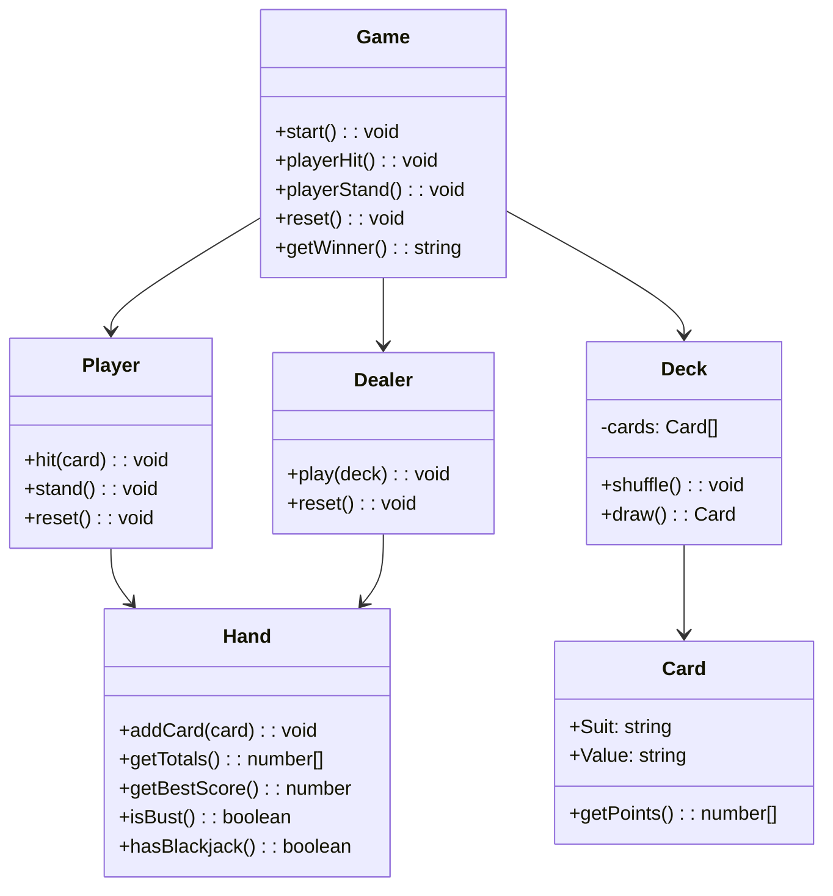
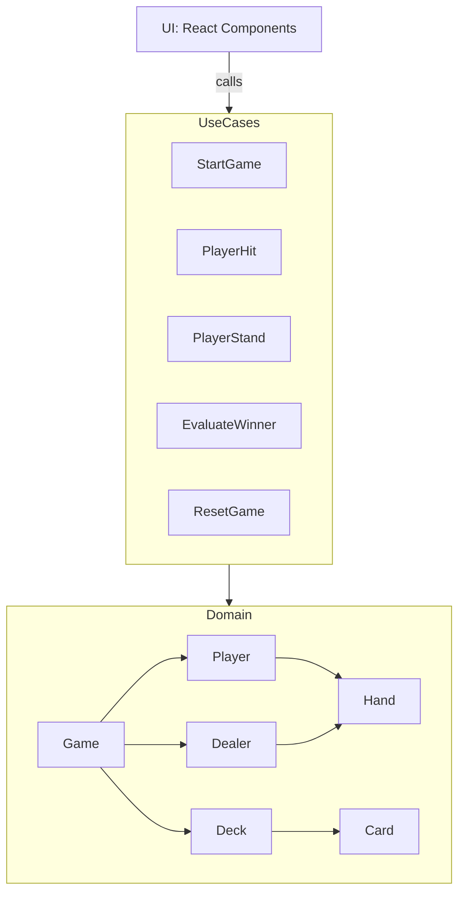

# ♠️ Blackjack Card Game

A full-featured, test-driven implementation of the classic Blackjack game built with **Next.js**, **TypeScript**, **Vitest**, **Tailwind CSS**, and following **Domain-Driven Design (DDD)** and **Hexagonal Architecture** principles.

---

## 🚀 Features

- ♠️ Classic Blackjack rules
- ✅ Fully typed domain with DDD modeling (Card, Deck, Hand, Game, etc.)
- 🎯 Application-layer use cases (StartGame, PlayerHit, PlayerStand, EvaluateWinner, ResetGame)
- 🧪 100% test coverage of domain, use cases, and UI with Vitest
- 🧩 Modular React components powered by clean state adapter
- 🎨 Tailwind CSS for styling
- ⚡ Instant feedback via Turbo dev server

---

## 🧱 Domain Model



---

## 🧩 Architecture



---

## 🧪 Tests

- Domain-level: Card, Deck, Hand, Player, Dealer, Game
- Application-layer: All use cases
- UI-layer: Components like `BlackjackBoard`, `HandView`, `StatusBar`, `ActionPanel`, etc.
- Vitest + Testing Library

---

## 🧠 Folder Structure

---

## 🧪 Run Tests

```bash
npm install
npm run test
```

---

## 💻 Run Dev Server

```bash
npm run dev
```

Open [http://localhost:3000](http://localhost:3000)

---

## 🧠 Tech Stack

- [x] Next.js (App Router)
- [x] TypeScript
- [x] Tailwind CSS
- [x] Vitest + Testing Library
- [x] DDD + Hexagonal Architecture

---

## 📜 License

MIT
