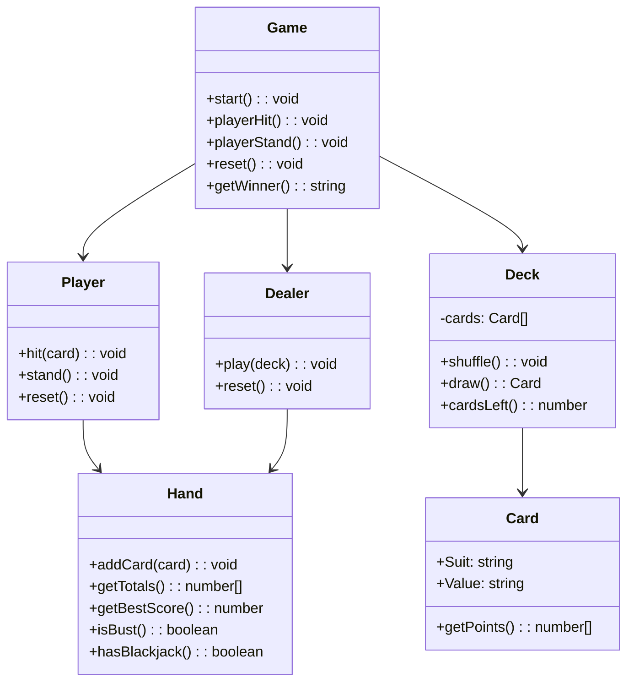
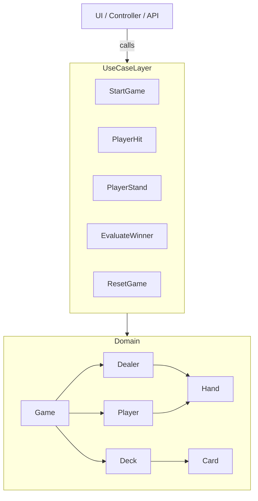

# 🂡 Blackjack Game - Domain & Architecture

## 🎯 Objective

This project implements a Blackjack game using **Next.js**, **TypeScript**, and follows **Domain-Driven Design (DDD)** with **Hexagonal Architecture**. The system is layered with clear separation of concerns and driven by explicit use cases.

---

## 🧠 Game Rules (Ubiquitous Language)

- The objective is to get a hand total as close to 21 as possible without going over.
- Numbered cards (2–10) are worth their face value.
- Face cards (J, Q, K) are worth 10.
- Aces are worth 1 or 11, whichever benefits the hand.
- A "Blackjack" is exactly 21 with the first 2 cards.
- If a hand exceeds 21, it's a **bust**.
- The dealer draws until reaching a minimum score of 17.
- If both hands are ≤ 21, the highest score wins.
- Tie scores are a draw.

---

## 🧱 Domain Model

---

## 🔁 Application Use Cases

| Use Case         | Description                                                 |
|------------------|-------------------------------------------------------------|
| `StartGame`       | Initializes game, deals two cards to each participant       |
| `PlayerHit`       | Draws a card for the player; finishes game if player busts  |
| `PlayerStand`     | Locks player, triggers dealer to play, ends game            |
| `EvaluateWinner`  | Returns result: `'player' | 'dealer' | 'draw'`              |
| `ResetGame`       | Resets all state (deck, player, dealer) for a fresh start   |

Each use case follows the `execute()` convention and receives the `Game` aggregate as its dependency.

---

## 🧪 Test Coverage

All domain logic and use cases are covered with **Vitest** unit tests, including:
- `Card`, `Deck`, `Hand`
- `Player`, `Dealer`
- `Game` and all game rules
- `StartGame`, `PlayerHit`, `PlayerStand`, `EvaluateWinner`, `ResetGame`

Tests are colocated inside `/tests/` folders under each domain module.

---

## 🧩 Hexagonal Architecture

- **UI/Controllers** call use cases
- **Use cases** orchestrate domain behavior
- **Domain** holds all business rules and logic

---

## 📦 Folder Structure (Simplified)

---

## 🔌 Ports & Adapters (planned)

To complete the hexagonal design:
- `UI Adapter` will map user inputs to use case calls
- `Output Adapter` will render game state and winner
- Game state will be exposed via a clean `GameStateDTO` (optional)

---

## 🗂 Next Steps

- [ ] Wire up the use cases into a UI adapter (React/Next.js)
- [ ] Build a presenter/controller to call `StartGame`, `PlayerHit`, etc.
- [ ] Add state serialization (`GameStateDTO`)
