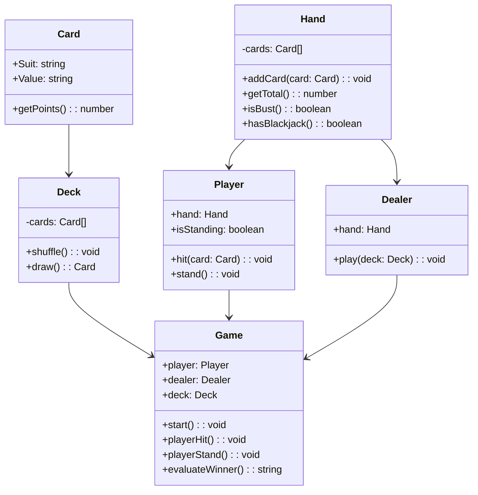
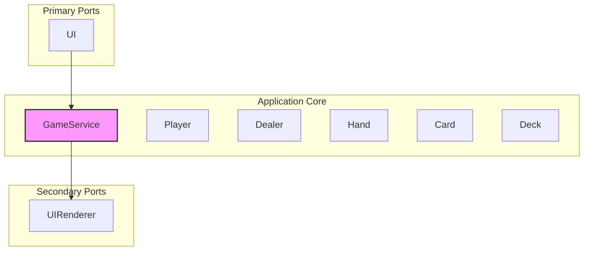

# 🂡 Blackjack Game Domain

## 🎯 Objective
Implement a Blackjack game using Next.js and TypeScript, following Domain-Driven Design (DDD) and Hexagonal Architecture. This document defines the core domain, bounded contexts, entities, and game rules that will drive the design and implementation.

---

## 🧠 Game Rules (Ubiquitous Language)

- The goal is to have a hand total as close to 21 as possible without going over.
- Players are dealt two cards initially.
- The player can choose to **Hit** (draw a card) or **Stand** (end turn).
- Face cards (Jack, Queen, King) are worth 10 points.
- Cards 2-10 are worth their face value.
- Aces can be worth 11 points, but if that causes a bust, they count as 1.
- The dealer reveals one card and draws until their total is **17 or higher**.
- If the player busts (goes over 21), they lose.
- If the dealer busts and the player doesn’t, the player wins.
- If neither busts, the hand with the highest score wins.
- Ties are a draw.

---

## 🧱 Domain Model



---

## 🧭 Domain-Driven Design (DDD)

### 💡 Core Domain
The core domain is the **Game** logic, including rules for scoring, busting, standing, and determining a winner.

### 📦 Bounded Contexts
- **GameContext**: Handles gameplay, game state, and turn logic.
- **DeckContext**: Manages deck generation and card draws.
- **UIContext (Adapter)**: Interacts with user actions (start, hit, stand).

---

## 🧩 Hexagonal Architecture (Ports & Adapters)



---

## ✅ Acceptance Criteria

- [ ] The player can start a new game.
- [ ] The player can hit to draw cards.
- [ ] The player can stand to end their turn.
- [ ] The dealer plays automatically after the player stands.
- [ ] The game announces a winner (Player, Dealer, or Draw).
- [ ] All game logic follows Blackjack rules precisely.

---

## 🗂 Folder Structure

```bash
src/
├── core/                          # Domain Layer (Pure logic, framework-agnostic)
│   ├── game/                      # Application service and game rules
│   │   ├── application/           # Game orchestrator logic (use cases)
│   │   ├── domain/                # Domain models & business rules
│   │   │   ├── Game.ts
│   │   │   ├── GameRules.ts
│   │   │   └── GameEvents.ts
│   │   └── services/              # Domain services (e.g., scoring, game resolution)
│   ├── player/                    # Player entity and behavior
│   │   ├── domain/
│   │   │   └── Player.ts
│   ├── dealer/                    # Dealer entity and AI logic
│   │   ├── domain/
│   │   │   └── Dealer.ts
│   ├── deck/                      # Deck and card logic
│   │   ├── domain/
│   │   │   ├── Card.ts
│   │   │   ├── Deck.ts
│   │   │   └── Hand.ts
│   └── shared/                    # Value objects, enums, types
│       ├── CardSuit.ts
│       ├── CardValue.ts
│       └── Result.ts              # Generic result wrapper for functional error handling
├── adapters/                      # UI framework-specific or external world adapters
│   └── ui/                        # React components or pages
├── ports/                         # Port interfaces (used by application layer)
│   ├── input/                     # Commands, events, user-driven actions
│   └── output/                    # Interfaces to external systems (e.g., renderer)
├── app/                           # Next.js pages, serverless handlers, etc.
├── shared/                        # Shared utilities, types, helpers
└── index.ts                       # App entry point
```

---

## 📎 Notes

- Use dependency injection to decouple services.
- The domain layer must be completely framework-agnostic.
- Testing will focus primarily on domain logic with unit tests.
